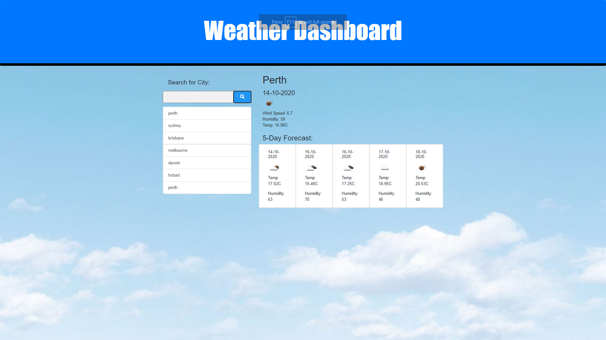

# Weather-Dashboard

### Instructions:

Build an App that any traveler can use to show the current weather and the 5 Days Forecast so they can plan for their trip. 

 

### Acceptance Criteria

An App should have the following;

-Weather dashboard with form inputs
-Asking user to enter City to search
-Will be presented with current and future conditions for that city and that city is added to the search history
-When the user view current weather conditions for that city
-User is presented with the city name, the date, an icon representation of weather conditions, the temperature, the humidity, the wind speed, and the UV index
-WHEN the user view the UV index
-User is presented with a color that indicates whether the conditions are favorable, moderate, or severe
-WHEN the userview future weather conditions for that city
-User is presented with a 5-day forecast that displays the date, an icon representation of weather conditions, the temperature, and the humidity
-After the user click on a city in the search history
-User is presented with current and future conditions for that city
-When the User open the weather dashboard
-User is presented with the last searched city forecast

### Technologies used to build the App
<ul>
<li>HTML
<li>CSS
<li>Javascript
<li>openweather.API
<li>Moment.js

</ul>

 

### Screenshot of the App

 

 

 ## To view my App, please click on the link below

[Weather Dashboard App](https://amybaguio.github.io/Weather-Dashboard/)

